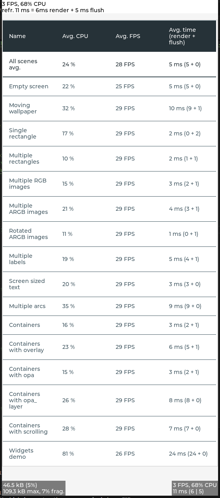
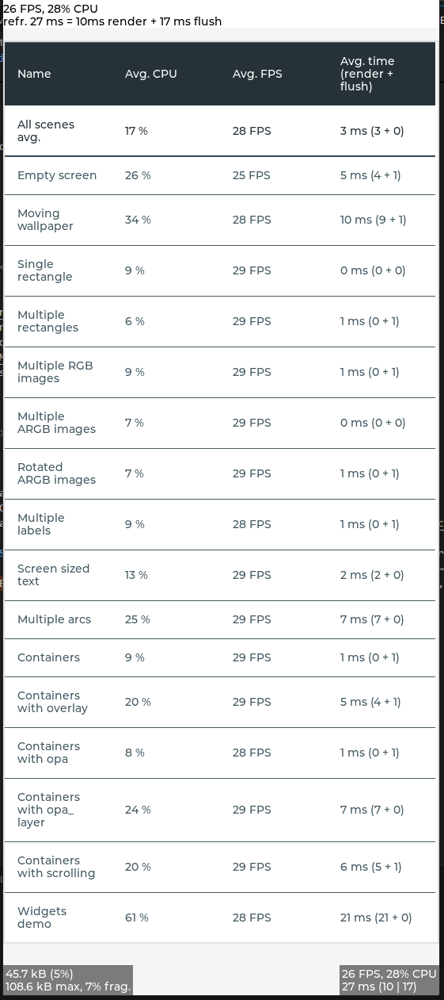

# Testing different properties of LVGL for performance and visualization
Disclaimer: If not added yet, the tests are sololy done on windows with mingw64, not on a mc or other environments. Performance numbers are all gained from the provided windows/vs-code settings by the original repo.

## Testing lv_init Properties

<b>Testcases:</b>

1. [x]lv_draw_sw_init(): complex vs. simple drawing
2. [x]SDL: active vs. non-active (further testing needed)
3. [x]lv_sysmon_builtin_init(): Performance testing
4. [x]Builtin memory tests: Performance testing with/without (further testing needed)
5. [x]Cache size: Performance testing (further testing needed)

## Restults lv_init Properties

<b>Testutilities LVGL lv_sysmon_builtin_init():</b>

1. In lv_conf.h set LV_USE_SYSMON and LV_USE_PERF_MONITOR to '1'.  
  
Values in order: calc. FPS, CPU usage rel., avg. time for render + flush, avg. time render, avg. time flush
2. as 1. but also set LV_USE_MEM_MONITOR to '1'. Make sure you dont change the STDLIB setting, to use LVGL's.  
  
Values in order: used kB abs., used kB rel., used kB max. abs., fragmentation used rel.

<b>Testoutcomes lv_demo_widgets and Conclusions:</b>

| Testcase | Outcome |
|:---------|:--------|
| Complex vs. Simple Drawing lv_draw_sw_init() | Simple can't compile because of dependencies. Other Testprogram needed. |
| SDL active vs. non-active lv_conf.h LV_USE_DRAW_SDL CMakeLists.txt LV_USE_DRAW_SDL OFF | No significant differences detected in idle after starting the program: SDL-Caching EN:  SDL-Caching DEN:  **Conclusion**: Further testing needed, e.g. benchmarking example |
| Dis-/Enabled builtin memory tests in lv_conf.h **LV_USE_ASSERT**_... ...**STYLE** and ...**OBJ** combined on/off for LVGL performance ...**MEM_INTEGRITY** on/off for RAM usage | STYLE/OBJ on: about 5s startuptime, min. FPS 22 STYLE/OBJ off: about 4.5s startuptime, min FPS 25 MEM_INTEGRITY on: upto 10% RAM usage (~98.9kB) MEM_INTEGRITY off: upto 10% RAM usage (~98.5kB) no significant difference **Conclusion**: Further testing needed, e.g. benchmarking example |
| Cache size for filesystem lv_fs_read() LV_FS_STDIO_CACHE_SIZE 0 LV_FS_STDIO_CACHE_SIZE 512 | Cachesize 0 Bytes: upto 10% RAM, upto 87% CPU Cachesize 512 Bytes: upto 10% RAM, upto 90% CPU  **Conclusion**: Further testing needed, e.g. benchmarking example |  

<b>Testoutcome Screenshots Benchmark</b>
 

**INFO**: LV_DRAW_SW_COMPLEX remains unchanged in both runs due to comiling problems, settingchanges below  

| Default Settings Benchmark | Optimized Settings Benchmark | 
|:---------------------------|:-----------------------------|
| - LV_USE_ASSER_... STYLE, MEM_INTEGRITY, OBJ = 1  - LV_FS_STDIO_CACHE_SIZE 0 |  - LV_USE_ASSER_... STYLE, MEM_INTEGRITY, OBJ = 1  - LV_FS_STDIO_CACHE_SIZE 1024 |
|  |  |  

**Condlusion**: The optimizations using the settingchanges shown above are having a huge impact on the overall CPU-usage and a minor impact on the FPS. The most ressource-intensive-task "Widgets demo" has 20%-points less average CPU usage and 2 FPS more in optimized mode. Overall all tests benefit from the optimization by using up to 50% less CPU capabilities in optimized mode. However there is one outlier with "Moving wallpaper". The Test uses 2%-points more in optimized mode than in default. 
Testing with no cache for lv_fs_read() mostly had a negative impact on the performance, especially with the tests "Containers with opa_layer", in a small sample of tests the missing cache resulted in a performance boost e.g. "Moving wallpaper" or "Containers with overlay". Depending on the usecase, this is good to keep in mind and implement either as a toggle option for runtime operations or do other optimizations where a lv_fs_read-cache is usefull or not.

## Testing sdl_hal_init() tbd

<b>Testcases:</b>

1. [ ]SDL_GetTicks (duration 49 days) vs. SDL_GetTicks64: 64 recommended, might not work
2. [ ]lv_display_create: Performance/Visual testing
      1. [ ]LV_DPI_DEF
      2. [ ]Antialiazing
      3. [ ]Color depth

## Results sdl_hal_init()

**TBD**